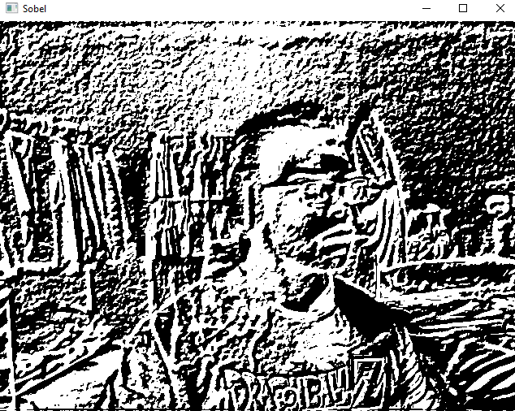
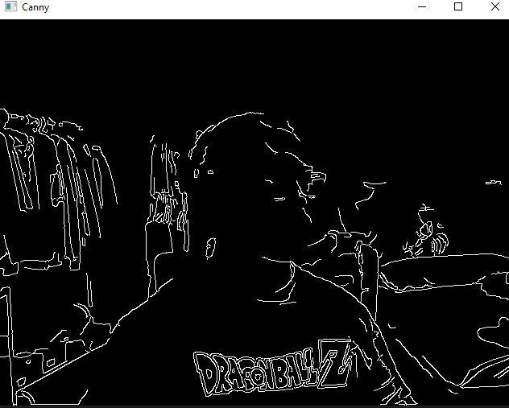
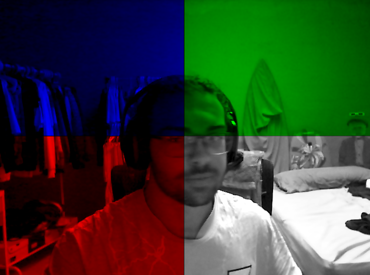
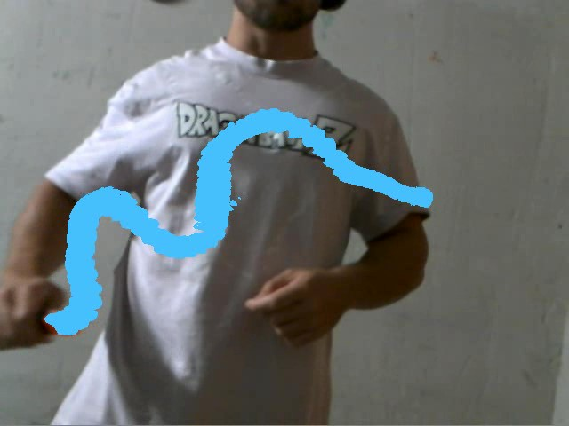

# Práctica 2 Visión por Computador

## Descripción
Este proyecto contiene una serie de scripts en Python que aplican técnicas de procesamiento de imágenes utilizando OpenCV para detectar bordes, colores, y realizar análisis sobre una imagen o video en tiempo real. Los algoritmos implementados incluyen operadores de bordes (Canny y Sobel), máscaras de color y manipulaciones de canales RGB, así como el uso de la cámara en tiempo real para aplicar estos filtros.

## Requisitos
Antes de ejecutar este notebook, hay que asegurarse de instalar los siguientes paquetes:

```bash
pip install opencv-python numpy matplotlib
```

## Contenido

### 1. **Lectura y Conversión a Escala de Grises**
Primero, se carga una imagen (`mandril.jpg`) y se convierte a escala de grises para poder analizarla y aplicar filtros más adelante. El código también verifica si la imagen se ha leído correctamente.

### 2. **Conteo de Píxeles Blancos por Fila y Columna**
Se implementan dos funciones principales:
- `countWhitePixels(matrix)`: Cuenta el número de píxeles blancos por fila y columna de una imagen binaria.
- `rowsWithHigherPixelCountThanPercentageofMax(rows, percentage)`: Cuenta cuántas filas superan un umbral de píxeles blancos basado en un porcentaje del máximo número de píxeles en una fila.

### 3. **Aplicación de Operadores de Detección de Bordes: Canny y Sobel**
- Se aplican los métodos de detección de bordes de **Canny** y **Sobel** sobre la imagen en escala de grises.
- Se comparan los resultados de ambos métodos, calculando el máximo de píxeles blancos y cuántas filas superan el 95% del máximo número de píxeles blancos.

### 4. **Comparación de Diferencias entre Canny y Sobel**
Se realiza una comparación visual entre las dos técnicas de detección de bordes (Canny y Sobel) mostrando las diferencias entre ellas y resaltando las zonas con mayor diferencia utilizando un umbral binario.

### 5. **Aplicación de Filtros Sobel y Canny en Video en Tiempo Real**
- **Filtro Sobel**: Detecta los bordes en tiempo real a partir de la cámara web aplicando un filtro Sobel.



- **Filtro Canny**: Aplica el filtro Canny en tiempo real a través de la webcam.



### 6. **División de la Imagen en Cuadrantes y Manipulación de Canales RGB**
Se divide la imagen capturada de la cámara en 4 cuadrantes, y se aplican distintos filtros de color:
- Cuadrante superior izquierdo: Solo canal azul.
- Cuadrante superior derecho: Solo canal verde.
- Cuadrante inferior izquierdo: Solo canal rojo.
- Cuadrante inferior derecho: Imagen en escala de grises.



### 7. **Detección de Color Naranja y Trazado de una Línea Azul**
Detecta el color naranja en la imagen (por ejemplo, un rotulador) y traza una línea azul donde se encuentra el color detectado. Este proceso se aplica a través de una máscara de color y se combina con la imagen original.



El video de demostración se encuentra en la carpeta *[videos](videos)*

## Cómo Ejecutar el Proyecto
1. Clonar o descargar el repositorio.
2. Asegurarse de tener instalados los paquetes necesarios: OpenCV, NumPy y Matplotlib.
3. Ejecutar el notebook o los scripts correspondientes en un entorno de desarrollo (como Jupyter Notebook o directamente en un IDE que soporte Python).
4. Para trabajar con la cámara web en tiempo real, asegurarse de tener una cámara conectada y funcional.

### Nota:
El último script contiene código comentado para guardar los resultados del procesamiento en un archivo de video. Si deseas habilitar esta funcionalidad, simplemente descomenta las líneas correspondientes.

---
Saúl Antonio Cruz Pérez  
Carlos Mireles Rodríguez  

Universidad de las Palmas de Gran Canaria  
Escuela de Ingeniería en Informática  
Grado de Ingeniería Informática  
Visión por Computador  
Curso 2024/2025